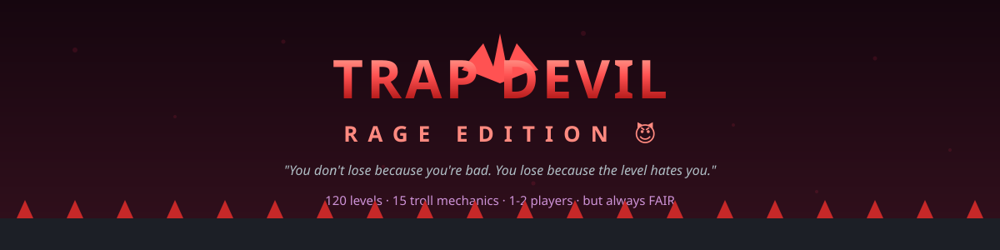

# 😈 TRAP DEVIL: RAGE EDITION 3.0 — MAXIMUM



> **"You don't lose because you're bad. You lose because the level hates you."**

A rage-inducing, troll-filled, **but always fair** 2D platformer.
**500 levels + ♾️ ENDLESS (no ceiling). 1–2 players + 2P RACE. Zero dependencies. Zero assets. 100% spite.**

Built with vanilla JavaScript, HTML5 Canvas and WebAudio. Everything — physics,
levels, traps, bosses, rendering, sound effects, even the music — is generated in code.

[](https://developer.mozilla.org/en-US/docs/Web/JavaScript)
[](https://github.com)
[](https://github.com)
[](LICENSE)

---

## 😤 The Rage Curve

| Levels | Mood |
|--------|------|
| 1–20 | 😐 "Easy hai." |
| 21–40 | 😤 "Ye trap kahan se aaya?" |
| 41–60 | 😡 "Bhai ye unfair hai!" |
| 61–80 | 🤬 "MAIN GAME DELETE KAR RAHA HOON." |
| 81–100 | 💀 "Bas ek aur try…" |
| 101–120 | ☠️ "Welcome to Hell." |
| 121–150 | ☠️💀 "HELL MODE — you asked for this." |
| 151–300 | ☠️💀 "DEEP HELL — the Devil is warming up." |
| 301–500 | ☠️💀💀 "THE DEVIL'S PLAYGROUND — max difficulty." |
| 501+ | ♾️ "ENDLESS HELL — no ceiling." (♾️ Endless mode) |

## 😈 Troll Mechanics (21 + bosses)

**Classic 15:**
- 🫥 **Crumbling floor** — vanishes 0.6s after you *stand* on it
- 🐄 **Coward floor** — vanishes 0.25s after you *leave* it
- 🎭 **Fake platform** — looks solid, you fall through (dashed outline = the tell)
- 🧱 **Invisible walls** — solid, invisible; flash when you bump them
- 🔁 **Reverse zone** — your A/D keys lie to you for a few seconds
- 📷 **Camera flip** — the whole screen rotates 180° for 4 seconds
- 🌍 **Layout shift** — the level *changes* the moment you enter a zone
- 🌀 **Teleport pad** — a "shortcut" that goes backwards
- 💾 **Fake checkpoint** — purple flag, saves nothing
- 🚩 **Fake finish** — gray flag, sends you back to spawn
- ⚔️ **Killer door** — looks safe, kills on touch
- 🪨 **Rock spawner** — drops rocks on your head (shadow warns you first)
- 🏗️ **Crusher** — ceiling slams down when you're underneath
- ⇄ **Moving platforms** — ride them across spiked pits
- 🎚️ **Lever + door** — and a **wrong lever** that kills you (both of you)
- 👥 **2-player shared fate** — one player dies → **BOTH PLAYERS RESTART** (co-op)

**💀💀 HELL tier (2.0):**
- 🔴 **Laser beams** — level-wide ON/OFF cycle; bright red kills, dim + dashed is safe
- ➡️ **Conveyor belts** — carry you whether you like it or not (arrows = the tell)
- 🧊 **Ice floors** — low friction; you slide, you do NOT stop
- 💨 **Updraft wind** — floaty gravity inside cyan zones
- 🚪 **One-way doors** — pass forward, blocked backwards (green → = the tell)
- ⏰ **Level timers** — HUD countdown + ticking in the last 5 seconds
- 🌑 **Darkness** — spotlight around you; traps glow faintly red (the tell)
- 👹 **THE DEVIL (boss)** — a giant spiked ball that rolls the arena floor; roars + shakes before every turn

**🆕 3.0 MAX — six more traps:**
- 🍄 **Bounce pad** — a spring that LAUNCHES you (boing!)
- ⛓️ **Pendulum** — a spiked ball on a chain, swinging in a visible arc
- 🔫 **Spike shooter** — a barrel that blinks red, then fires visible shots
- ⬆️ **Rising spikes** — floor spikes that pop up on a cycle (cracks + rumble = the tell)
- 🌀 **Vortex** — a purple tornado that pulls you toward its center
- 🔀 **Swap pad** — trade bodies with your friend (2P troll!)

**Modes:**
- 😈 **Rage Mode** (toggle in menu) — die 8 times in a level → traps get **faster**
- ♾️ **Endless** — starts at level 151; generated levels ramp FOREVER (501, 502, 503… no ceiling)
- 💀 **Hardcore** — ONE life; first death = run over; full 500-level clear earns 🥉/🥈/🥇 medals
- 🏁 **2P RACE** — COMPETITION: first to the goal wins, individual lives (no shared fate!)
- 📅 **Daily Hell** — one seeded level per day, same for everyone; build a streak
- 🏆 **Leaderboard** — local, zero-server: Story any% · Endless streaks · Hardcore runs · Race wins
- 🏅 **18 achievements** — from "First Blood" to "Devil King"
- 😈 **Secret** — type `DEVIL` in the main menu

**Boss fights:** 👹 at levels **200, 250, 300, 350** (one Devil) and **400, 450, 500** (TWO Devils!) — level 500 is 👑 **THE DEVIL KING (FINAL BOSS)**.

## ⚖️ The One Rule (The Fairness Promise)

> **No random impossible death. Every trap is technically discoverable and beatable.**

Every trap has a **TELL** — a visual or audio warning before it strikes:

| Trap | The Tell |
|------|----------|
| Crumbling floor | shakes + cracks before it vanishes |
| Coward floor | cracks appear while you stand on it |
| Fake platform | dashed outline, slightly transparent |
| Invisible wall | flashes when you bump it |
| Reverse zone | purple zone + ⇄ status icon |
| Camera flip | cyan zone + warning toast |
| Layout shift | orange zone + audible RUMBLE + screen shake |
| Teleport pad | swirl animation |
| Fake checkpoint | purple, flickering (real = green, steady) |
| Fake finish | gray flag, no glow (real goal = glowing portal) |
| Wrong lever | red handle (real lever = green) |
| Killer door | red pulsing outline |
| Rock spawner | shadow on the ground **before** the rock drops |
| Crusher | shadow + warning shake before it drops |
| Moving platform | ⇄ arrows on it |
| Laser beam | bright RED while ON, dim + dashed while OFF (+ hum when ON) |
| Conveyor belt | glowing arrows show the direction |
| Ice floor | frost-blue with sparkles |
| Updraft wind | cyan zone with rising arrows |
| One-way door | blue with a green → arrow |
| Level timer | HUD countdown + ticking in the last 5 seconds |
| Darkness | spotlight around you; traps glow faintly red |
| The Devil (boss) | huge, visible, ROARS + screen shake before changing direction |
| Bounce pad | yellow spring (squashes when it fires) |
| Pendulum | chain + spiked ball, swings in a visible arc |
| Spike shooter | barrel blinks red, then fires (shots are visible) |
| Rising spikes | cracks + shake right before they pop up |
| Vortex | purple swirl |
| Swap pad | two-color swirl |

Die to a trap once and the game shows you a **hint** (press **H** anytime).
You die, you learn: *"अरे! मुझे समझ आ गया… मेरी галती थी."* — and that's what makes it addictive.

## 🎮 How to Play

| Action | P1 | P2 |
|--------|----|----|
| Move | A / D | ← / → |
| Jump | W or Space | ↑ |
| Hint | H | H |
| Restart level | R | R |
| Mute | M | M |
| **Fake pause 😈** | tap ESC | tap ESC |
| **Real pause** | **HOLD ESC** (0.8s) or ` | **HOLD ESC** or ` |

**2-Player rules:**
- **Co-op (shared fate):** if one player dies, **both restart**. Both must stand on the goal together.
- **Race (competition):** first to the goal wins. Individual lives — die and YOU respawn, your rival keeps running.

## 🚀 Run it

```bash
# zero install needed — it's pure static files
npm start          # serves at http://localhost:8000
# or: python3 -m http.server 8000
# or just open index.html in a browser
```

## 🧪 Tests (yes, a troll game has tests)

```bash
npm run validate   # proves ALL 500 levels + 30 endless samples are beatable
npm test           # 45 headless physics/gameplay smoke tests (no browser needed)
```

`tools/validate-levels.cjs` runs a jump-aware BFS over every level (walk / jump
up to 5 tiles / drop / fall off edges; one-way doors and rising spikes count as
passable at their safe phase; moving-platform paths count as standable) and
**fails the build** if any goal is unreachable. The ONE RULE is enforced by
CI-able code, not by vibes.

## 📁 Project Structure

```
trap-devil-rage-edition/
├── index.html               # entry point
├── css/style.css            # rage-red glitch theme
├── js/
│   ├── audio.js             # WebAudio SFX + tense music loop (all synthesized)
│   ├── levels.js            # 64 handcrafted + 436 generated = 500 levels + ♾️ endless + daily + boss generators
│   ├── engine.js            # physics, traps, bosses, race — pure logic, no DOM
│   └── game.js              # rendering, menus, HUD, leaderboard, achievements, save
├── tools/
│   ├── validate-levels.cjs  # "is every level beatable?" — run in CI
│   ├── smoke-test.cjs       # 45 headless gameplay tests
│   ├── serve.cjs            # zero-dependency static server (npm start)
│   └── build-single-file.cjs# bundles the whole game into one .html
├── assets/banner.svg        # README banner
├── package.json             # start / validate / test / build:single scripts
├── LICENSE                  # MIT
└── README.md
```

## 🗺️ Roadmap

- [x] **2.0** — 30 HELL levels (121-150), lasers, conveyors, ice, wind, one-way doors, timers, darkness, first boss, Endless, Hardcore, Rage Mode
- [x] **3.0 MAXIMUM** — 500 levels, 6 new traps (bounce/pendulum/shooter/rising spikes/vortex/swap), 8 boss fights (2 Devils at 400+), 2P Race, local leaderboard, 18 achievements, Daily Hell, DEVIL cheat code
- [ ] **3D mode** (Three.js) — "realistic 3D" as promised in the design doc
- [ ] Online 2-player (WebRTC / WebSockets) + online leaderboards
- [ ] Speedrun leaderboards (server)
- [ ] Mobile touch controls
- [ ] Level editor

## 🤝 Contributing

PRs welcome. If you add a trap, it **must** have a tell — that's the one rule.
Run `npm run validate && npm test` before opening a PR.

## 📜 License

[MIT](LICENSE) — do whatever you want, just don't blame us when you rage-quit.

---

*Made with vanilla JS + pure spite. No assets were harmed in the making of this game.*
